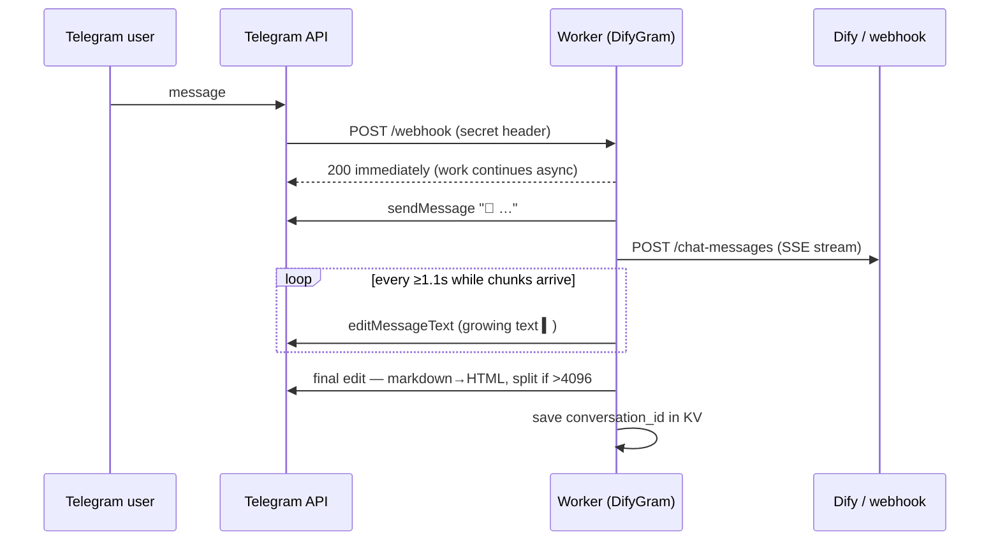

# DifyGram

**Turn any [Dify](https://dify.ai) app — or any HTTP webhook (n8n, Flowise, your own API) — into a Telegram bot with ChatGPT-style streaming. One free Cloudflare Worker, zero dependencies.**

[](https://github.com/midat-fx/difygram/actions/workflows/ci.yml)
[](https://deploy.workers.cloudflare.com/?url=https://github.com/midat-fx/difygram)
[](LICENSE)

<!-- demo.gif: streaming answer growing inside a Telegram message -->

The answer *types itself* into the Telegram message as the model generates it — the same live-typing feel as ChatGPT, done with throttled `editMessageText` calls. No polling, no queues, no servers to babysit.

## Why this exists

Dify gives you a great agent builder, but its Telegram story is "write your own integration". Most integrations people write:

- wait for the full LLM answer, then send one big message (feels slow),
- break on Telegram's MarkdownV2 escaping (`400: can't parse entities`),
- silently drop answers longer than 4096 characters,
- forget the conversation on every message.

DifyGram handles all four, in ~500 lines of typed, tested Worker code.

## Features

- **Live streaming** — Dify's SSE stream rendered into one growing message, throttled to respect Telegram rate limits (with `retry_after` back-off).
- **Conversation memory** — `chat_id → conversation_id` stored in Workers KV; `/reset` starts over. Stale ids (deleted on the Dify side) are detected and retried fresh.
- **Safe formatting** — markdown converted to Telegram HTML (not MarkdownV2), with plain-text fallback if Telegram rejects the markup. Code blocks survive intact.
- **Long answers** — split on paragraph boundaries and delivered fully, never truncated.
- **Any backend** — `BACKEND_MODE=generic` POSTs to any HTTP endpoint and understands common reply shapes (`{"reply"}`, `{"output"}`, n8n arrays, plain text).
- **Boring reliability** — webhook secret check, update dedup, graceful error messages, 32 unit tests, zero runtime dependencies.

## 5-minute setup

1. **Create a bot**: message [@BotFather](https://t.me/BotFather) → `/newbot` → copy the token.
2. **Get a Dify API key**: Dify → your app → *API Access* → create key (`app-...`).
3. **Deploy**: click *Deploy to Cloudflare* above (it provisions the KV namespace automatically), then set three secrets in the Worker settings — or via CLI:

   ```sh
   wrangler secret put TELEGRAM_BOT_TOKEN
   wrangler secret put DIFY_API_KEY
   wrangler secret put WEBHOOK_SECRET   # any long random string
   ```

4. **Wire the webhook**: open `https://<your-worker>.workers.dev/setup?secret=<WEBHOOK_SECRET>` once.
5. Message your bot.

<details>
<summary>Manual setup with wrangler CLI</summary>

```sh
git clone https://github.com/midat-fx/difygram && cd difygram
npm install
wrangler kv namespace create SESSIONS   # paste the id into wrangler.jsonc
wrangler secret put TELEGRAM_BOT_TOKEN
wrangler secret put DIFY_API_KEY
wrangler secret put WEBHOOK_SECRET
npm run deploy
# then visit /setup?secret=... as above
```

</details>

## Using n8n / Flowise / your own API instead of Dify

Set two vars in `wrangler.jsonc` (or the dashboard):

```jsonc
"vars": { "BACKEND_MODE": "generic" }
```

```sh
wrangler secret put GENERIC_WEBHOOK_URL    # e.g. your n8n production webhook URL
```

DifyGram will POST:

```json
{ "chat_id": 123, "user": "tg-123", "text": "hello", "source": "telegram" }
```

…and accept any of these replies: plain text, `{"reply": "..."}`, `{"answer"}`, `{"output"}`, `{"text"}`, `{"message"}`, or the n8n *Respond to Webhook* array `[{"output": "..."}]`.

| Backend | Status |
|---|---|
| Dify (cloud & self-hosted) | ✅ tested, streaming |
| n8n webhook | ✅ tested, single response |
| Any HTTP endpoint | ✅ same contract as n8n |
| Flowise | ◻ untested — same contract should apply |

## Configuration

| Name | Kind | Required | Meaning |
|---|---|---|---|
| `TELEGRAM_BOT_TOKEN` | secret | yes | BotFather token |
| `WEBHOOK_SECRET` | secret | yes | protects `/webhook` and `/setup` |
| `BACKEND_MODE` | var | no | `dify` (default) or `generic` |
| `DIFY_API_URL` | var | no | default `https://api.dify.ai/v1`; point at your self-hosted Dify |
| `DIFY_API_KEY` | secret | dify mode | Dify app key (`app-...`) |
| `GENERIC_WEBHOOK_URL` | secret | generic mode | your endpoint |
| `GENERIC_AUTH_HEADER` | secret | no | sent as `Authorization` to the generic backend |

## How it works



## Notes & limits

- **Telegram edits** are throttled to ~1/s per chat; on `429` the Worker sleeps exactly `retry_after` and retries once.
- **KV free tier** allows 1,000 writes/day — DifyGram writes only when a conversation id *changes* (≈ one write per new conversation), so the free tier is plenty.
- **Dedup** uses the per-colo Cache API (best effort): Telegram re-delivers updates when a webhook is slow; the Worker answers instantly and skips updates it has already seen.
- **Dify sandbox** gives 200 one-time message credits — add your own model provider key (e.g. a free Gemini key) in Dify to keep the demo free forever.
- Everything runs comfortably inside Workers' free plan (streaming waits are I/O, not CPU time).

## Development

```sh
npm run dev        # local worker
npm test           # 32 unit tests (SSE parser, formatter, splitter, throttle)
npm run typecheck
```

## License

[MIT](LICENSE) © Midat Faizov
