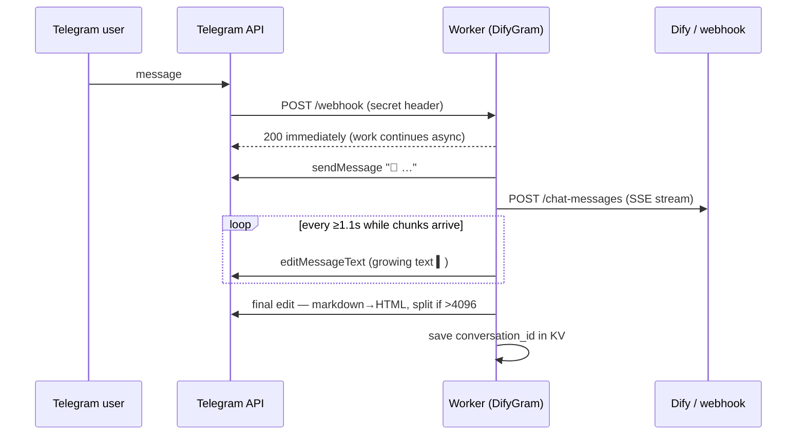

# DifyGram

**Turn any [Dify](https://dify.ai) app — or any HTTP webhook (n8n, Flowise, your own API) — into a Telegram bot with ChatGPT-style streaming. One free Cloudflare Worker, zero dependencies.**

[](https://github.com/midat-fx/difygram/actions/workflows/ci.yml)
[](https://deploy.workers.cloudflare.com/?url=https://github.com/midat-fx/difygram)
[](LICENSE)
[](https://t.me/difygram_demo_bot)

**Landing:** https://difygram.faizov-midat.workers.dev · **Try it:** [@difygram_demo_bot](https://t.me/difygram_demo_bot)

<!-- demo.gif: streaming answer growing inside a Telegram message -->

The answer *types itself* into the Telegram message as the model generates it — the same live-typing feel as ChatGPT, done with throttled `editMessageText` calls. No polling, no queues, no servers to babysit.

## Why this exists

Dify gives you a great agent builder, but its Telegram story is "write your own integration". Most integrations people write:

- wait for the full LLM answer, then send one big message (feels slow),
- break on Telegram's MarkdownV2 escaping (`400: can't parse entities`),
- silently drop answers longer than 4096 characters,
- forget the conversation on every message.

DifyGram handles all four, in ~1,700 lines of typed, tested Worker code.

## Features

- **Live streaming** — Dify's SSE stream rendered into one growing message, throttled to respect Telegram rate limits (with `retry_after` back-off).
- **Stop button** — cancel a generation mid-stream; the partial answer is kept and formatted, not thrown away.
- **Thumbs up/down** — one tap files end-user feedback straight into Dify's Logs & Annotations.
- **Suggested follow-ups** — Dify's next-question suggestions become tappable rows under the answer.
- **Voice notes** — transcribed at the edge by Workers AI Whisper, then answered by your app; the transcript is echoed so a misheard question is obvious.
- **Photos** — sent to vision-capable apps as real uploads (the caption becomes the question).
- **Image replies** — pictures produced by your app arrive as Telegram photos.
- **Live agent status** — `🔧 web_search…` while an agent or chatflow runs its tools.
- **RAG citations** — `📚 Sources:` appended from Dify's retriever metadata (`CITATIONS=off` opts out).
- **Opening statement** — `/start` greets with your app's own message and starter questions.
- **Conversation memory** — `chat_id → conversation_id` stored in Workers KV; `/reset` starts over. Stale ids (deleted on the Dify side) are detected and retried fresh.
- **Safe formatting** — markdown converted to Telegram HTML (not MarkdownV2), with plain-text fallback if Telegram rejects the markup. Code blocks survive intact.
- **Long answers** — split on paragraph boundaries, paced to stay under Telegram's rate limit, never truncated.
- **Group-friendly** — answers `/cmd@thisbot`, ignores commands aimed at other bots, stays quiet on service messages, never loops with another bot.
- **Any backend** — `BACKEND_MODE=generic` POSTs to any HTTP endpoint and understands common reply shapes (`{"reply"}`, `{"output"}`, n8n arrays, plain text).
- **Boring reliability** — webhook secret check, weak-secret refusal, update dedup, per-chat generation lock, bot-token redaction in logs, graceful error replies, 108 unit tests, zero runtime dependencies.

## How it compares

| | **DifyGram** | LangBot / AstrBot | PlugBot | DIY Python scripts¹ | GPT-Telegram-Worker |
|---|---|---|---|---|---|
| ChatGPT-style streaming into one growing message | ✅ | varies by adapter | ✅ (toggle) | some | — |
| Runs with **no server** on a free tier | ✅ Cloudflare free | — Docker + VPS | — Docker, Postgres, Redis | — a box running 24/7 | ✅ but needs external Redis |
| Zero runtime dependencies | ✅ | — | — | — | — |
| Dify **and** n8n / Flowise / any HTTP webhook | ✅ | via plugins | Dify only | Dify only | — direct model APIs only |
| One-click deploy button | ✅ | — | — | — | ✅ |
| Time to first reply | ~5 min | 30+ min | 20+ min | varies | ~15 min |
| Unit-tested, typed, English docs | ✅ 108 tests | ✅ | partly | — | partly |

¹ e.g. [CyanidEEEEE/dify-telegram_bot](https://github.com/CyanidEEEEE/dify-telegram_bot), [QIN2DIM/telegram-dify-bot](https://github.com/QIN2DIM/telegram-dify-bot) — fine scripts, but they need a machine that never sleeps.

**Honest note:** if you need WeChat/QQ/Discord, plugins and a web UI — [LangBot](https://github.com/langbot-app/LangBot) and [AstrBot](https://github.com/AstrBotDevs/AstrBot) are excellent full platforms. DifyGram deliberately does one thing: your agent, in Telegram, streaming, in five minutes, for $0.

## 5-minute setup

1. **Create a bot**: message [@BotFather](https://t.me/BotFather) → `/newbot` → copy the token.
2. **Get a Dify API key**: Dify → your app → *API Access* → create key (`app-...`).
3. **Deploy**: click *Deploy to Cloudflare* above (it provisions the KV namespace automatically), then set three secrets in the Worker settings — or via CLI:

   ```sh
   wrangler secret put TELEGRAM_BOT_TOKEN
   wrangler secret put DIFY_API_KEY
   wrangler secret put WEBHOOK_SECRET   # any long random string
   ```

4. **Wire the webhook**: open `https://<your-worker>.workers.dev/setup?secret=<WEBHOOK_SECRET>` once.
5. Message your bot.

<details>
<summary>Manual setup with wrangler CLI</summary>

```sh
git clone https://github.com/midat-fx/difygram && cd difygram
npm install
wrangler kv namespace create SESSIONS   # paste the id into wrangler.jsonc
wrangler secret put TELEGRAM_BOT_TOKEN
wrangler secret put DIFY_API_KEY
wrangler secret put WEBHOOK_SECRET
npm run deploy
# then visit /setup?secret=... as above
```

</details>

## Using n8n / Flowise / your own API instead of Dify

Set two vars in `wrangler.jsonc` (or the dashboard):

```jsonc
"vars": { "BACKEND_MODE": "generic" }
```

```sh
wrangler secret put GENERIC_WEBHOOK_URL    # e.g. your n8n production webhook URL
```

DifyGram will POST:

```json
{ "chat_id": 123, "user": "tg-123", "text": "hello", "source": "telegram" }
```

…and accept any of these replies: plain text, `{"reply": "..."}`, `{"answer"}`, `{"output"}`, `{"text"}`, `{"message"}`, or the n8n *Respond to Webhook* array `[{"output": "..."}]`.

| Backend | Status |
|---|---|
| Dify (cloud & self-hosted) | ✅ tested, streaming |
| n8n webhook | ✅ tested, single response |
| Any HTTP endpoint | ✅ same contract as n8n |
| Flowise | ◻ untested — same contract should apply |

## Configuration

| Name | Kind | Required | Meaning |
|---|---|---|---|
| `TELEGRAM_BOT_TOKEN` | secret | yes | BotFather token |
| `WEBHOOK_SECRET` | secret | yes | protects `/webhook` and `/setup` |
| `BACKEND_MODE` | var | no | `dify` (default) or `generic` |
| `DIFY_API_URL` | var | no | default `https://api.dify.ai/v1`; point at your self-hosted Dify |
| `DIFY_API_KEY` | secret | dify mode | Dify app key (`app-...`) |
| `GENERIC_WEBHOOK_URL` | secret | generic mode | your endpoint |
| `GENERIC_AUTH_HEADER` | secret | no | sent as `Authorization` to the generic backend |
| `CITATIONS` | var | no | `on` (default) or `off` — append `📚 Sources:` from Dify's retriever metadata |
| `VOICE_MODE` | var | no | `auto` (default) transcribes voice notes via Workers AI, `off` replies with a short notice |
| `PROMO_FOOTER` | var | no | optional line appended to `/start` (e.g. a repo link); empty by default |

Voice notes need the Workers AI binding (already in `wrangler.jsonc`): free tier covers ~3.5 h of audio per day, shared across the whole account. Notes are capped at 60 s / 2 MB, photos at 10 MB.

**Multiple bots?** Deploy one Worker per bot — the Workers free plan allows up to 100 per account.

**Groups:** replies and `/commands` work out of the box. For plain `@mention` triggers, disable privacy mode in BotFather (`/setprivacy` → Disable).

## How it works



## Notes & limits

- **Telegram edits** are throttled to ~1/s per chat; on `429` the Worker sleeps exactly `retry_after` — previews retry once, final deliveries up to three times.
- **KV free tier** allows 1,000 writes/day — DifyGram writes only when a conversation id *changes* (≈ one write per new conversation), so the free tier is plenty.
- **Dedup** uses the per-colo Cache API (best effort): Telegram re-delivers updates when a webhook is slow; the Worker answers instantly and skips updates it has already seen.
- **Dify sandbox** gives 200 one-time message credits — add your own model provider key (e.g. a free Gemini key) in Dify to keep the demo free forever.
- **One generation at a time per chat**: a second message while the first is still streaming gets a polite "still answering" instead of forking the conversation.
- **Buttons** need `callback_query` in the webhook's `allowed_updates`. Upgrading from v1? Open `/setup?secret=…` once more.
- Everything runs comfortably inside Workers' free plan (streaming waits are I/O, not CPU time).

## Development

```sh
npm run dev        # local worker
npm test           # 108 unit tests (SSE parsing, formatting, splitting, throttling, buttons, guards, locks)
npm run typecheck
```

## License

[MIT](LICENSE) © Midat Faizov · available for Dify / Telegram-bot integration work — [get in touch](mailto:midat.faizov@gmail.com).

---

If DifyGram saved you an afternoon of Telegram API archaeology, a ⭐ helps other Dify/n8n folks find it.
